Add 2-4 relevant Mermaid diagrams to enhance the following article. Place diagrams strategically at key sections where visualization significantly aids understanding. Focus on the most important concepts - fewer, high-quality diagrams are better than many mediocre ones.

## Diagram Count Limit:
- **Maximum 3-4 diagrams per article** - quality over quantity
- Only add diagrams where they significantly enhance understanding
- If the article is short (under 1000 words), use 1-2 diagrams maximum

## Diagram Placement Rules:
- Place diagrams strategically where they add most value to understanding
- Ensure diagrams directly relate to and support the surrounding content
- **Diagram titles should be plain descriptive text** followed by a colon, like `User Authentication Flow:` - NOT `**Diagram: User Authentication Flow**`

### CRITICAL: Protected Structure Detection
**NEVER insert diagrams inside these markdown structures:**
- **Tables**: Lines starting with `|`. Wait until the ENTIRE table ends (no more `|` lines).
- **Bulleted lists**: Lines starting with `- `, `* `, or `+ `. Wait until the list is completely finished.
- **Numbered lists**: Lines starting with `1. `, `2. `, etc. Wait until the list is completely finished.
- **Code blocks**: Content between ``` or ~~~. Never insert inside code blocks.
- **Table of contents sections**
- **Nested structures**: If a table is inside a section, find the line AFTER the table ends.

### How to Identify Table Boundaries
```
| Header 1 | Header 2 |     <-- Table starts (line 10)
|----------|----------|     <-- Separator row
| Data 1   | Data 2   |
| Data 3   | Data 4   |     <-- Table ends here (line 13) - last row with |
                            <-- Line 14: SAFE to insert here!
Next paragraph...           <-- This is NOT part of the table
```

**Rule**: If line N contains `|`, check lines N+1, N+2, etc. Only use a `[line X]` marker where X is the FIRST line that does NOT start with `|`.

## Diagram Complexity Rules:
- **Keep diagrams simple by default** - only create complex diagrams when absolutely necessary to convey the concept
- **Prefer multiple simple diagrams over one complex diagram** - if a concept requires many elements, split it into 2-3 separate focused diagrams
- **Horizontal diagrams (LR/RL direction):** Maximum 3-4 blocks/nodes
- **Vertical diagrams (TD/BT direction):** Maximum 4-5 blocks/nodes
- If you need more blocks, split into multiple diagrams with clear titles indicating the relationship

## Content Rules:
- **NEVER include specific numbers in diagrams:**
  - No version numbers (e.g., "v2.3.1", "Python 3.11")
  - No pricing (e.g., "$99/month", "€500")
  - No dates (e.g., "2024", "Q3 2025")
  - No specific metrics (e.g., "50ms latency", "99.9% uptime")
- **NEVER use these special characters inside node labels:**
  - No double quotes (`"`) - use full words instead (e.g., `14-inch` not `14"`)
  - No single quotes (`'`) - use backticks or rephrase
  - No HTML entities (`<`, `>`, `&`)
  - Avoid unbalanced brackets that could break parsing
- Use generic, timeless labels that won't become outdated
- Focus on concepts, relationships, and processes rather than specific values

## Color Theme

Use these brand colors in all diagrams via Mermaid's `%%{init:...}%%` directive:
- Primary: {{project.branding.colors.primary}} (main nodes, arrows)
- Secondary: {{project.branding.colors.secondary}} (secondary elements)

**IMPORTANT**: Do NOT set diagram background color - it must remain transparent for rendering.

Example for flowchart:
```mermaid
%%{init: {'theme': 'base', 'themeVariables': { 'primaryColor': '{{project.branding.colors.primary}}', 'primaryTextColor': '{{project.branding.colors.primary_text}}', 'primaryBorderColor': '{{project.branding.colors.primary}}', 'lineColor': '{{project.branding.colors.secondary}}', 'secondaryColor': '{{project.branding.colors.secondary}}', 'tertiaryColor': '{{project.branding.colors.secondary}}', 'background': 'transparent'}}}%%
graph TD
    A[Start] --> B[Process]
```

## Diagram Type Selection Guide

Choose the most appropriate diagram type based on the content being visualized:

| Content Type | Recommended Diagram | When to Use |
|-------------|---------------------|-------------|
| Step-by-step process | Flowchart (TD/LR) | Workflows, decision trees, how-to guides |
| Historical/sequential events | Timeline | Evolution, roadmaps, project phases |
| System interactions | Sequence Diagram | API flows, request/response, communication |
| User experience steps | User Journey | Onboarding, customer experience, UX flows |
| Proportional data | Pie Chart | Market share, distribution, breakdown |
| Object lifecycles/states | State Diagram | Order status, account states, document lifecycle |

**Important:** Select the diagram type that best represents the concept. Don't default to flowcharts - use Timeline for chronological content, Sequence for interactions, etc.

## Technical Guidelines:
- Use proper Mermaid syntax enclosed in code blocks with `mermaid` language identifier
- Choose the most appropriate diagram type from the guide above
- Keep diagrams clear and readable

## Examples by Diagram Type:

### ✅ Good - Simple horizontal diagram (3 blocks):
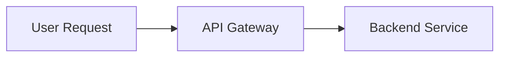

### ✅ Good - Simple vertical diagram (4 blocks):
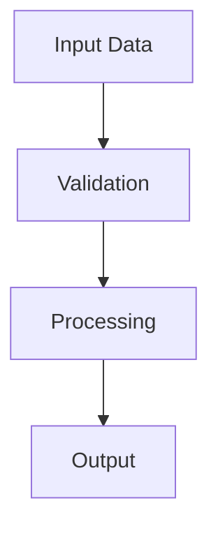

### ❌ Bad - Too many horizontal blocks:
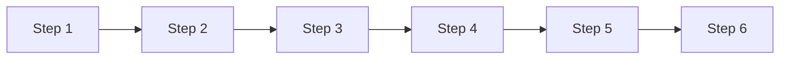

### ❌ Bad - Contains specific version/pricing:
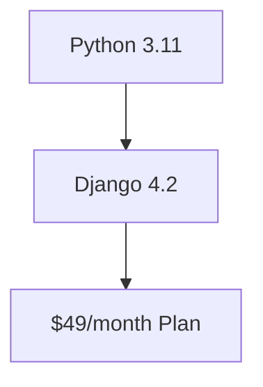

### ✅ Good - Generic, version-agnostic:
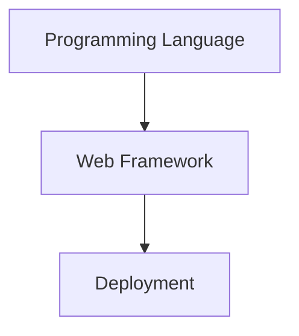

### ❌ Bad - Special characters in labels:
```mermaid
graph TD
    A[MacBook Pro 14"] --> B[M5 Chip]
```

### ✅ Good - Spelled out text:
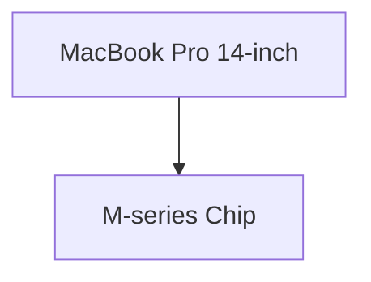

### ✅ Good - Split complex concept into two diagrams:

Data Ingestion Flow:
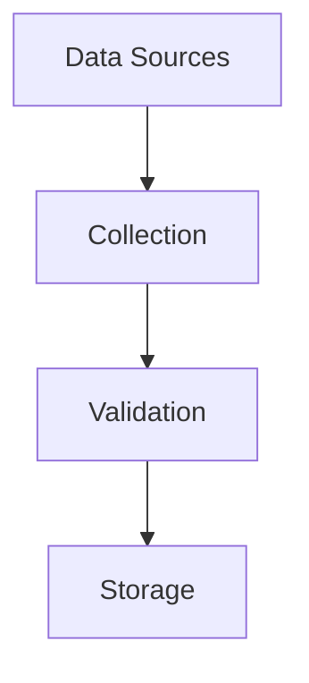

Data Processing Pipeline:
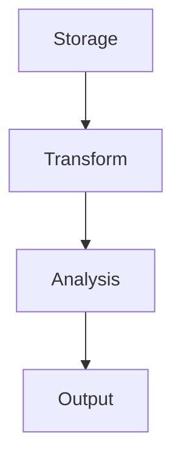

### ✅ Good - Timeline (for chronological/historical content):
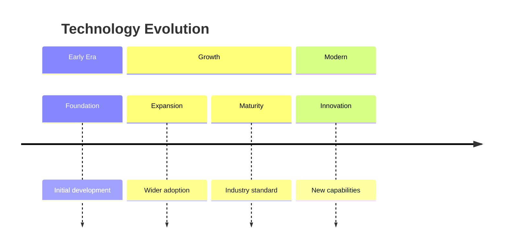

### ✅ Good - Sequence Diagram (for interactions/API flows):
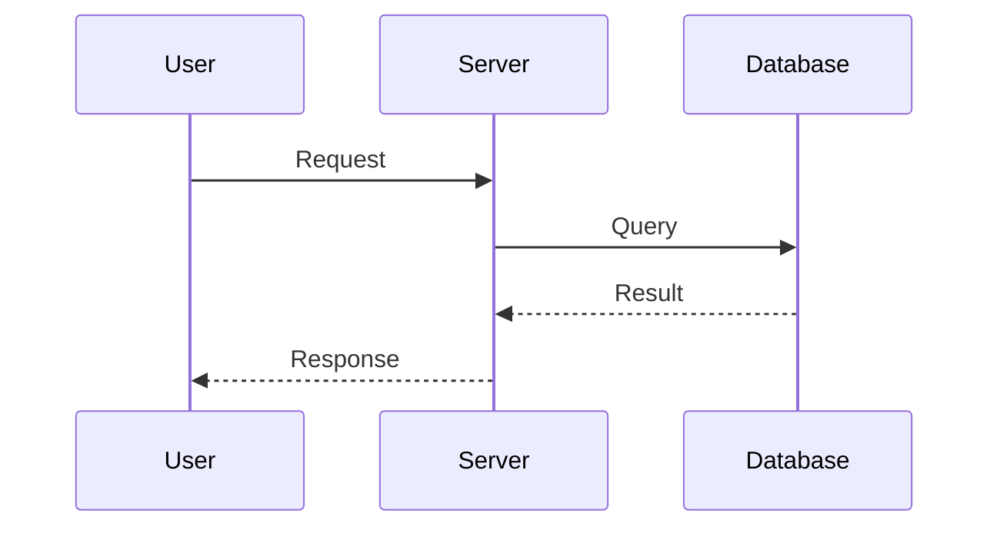

### ✅ Good - User Journey (for UX/customer experience):
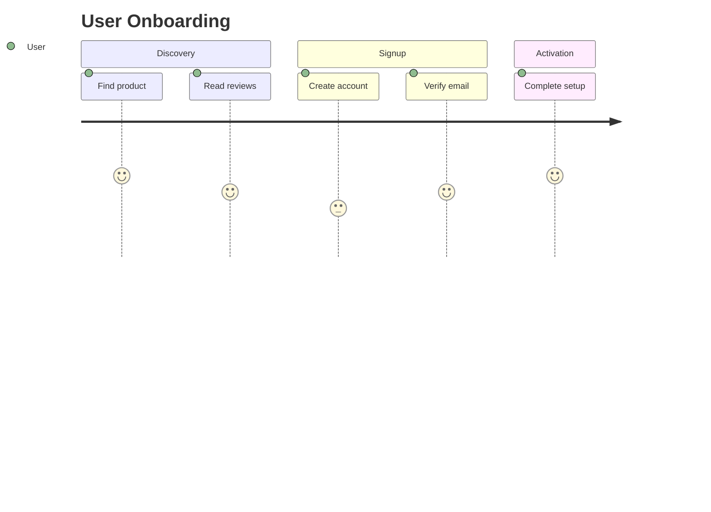

### ✅ Good - Pie Chart (for proportions/distribution):
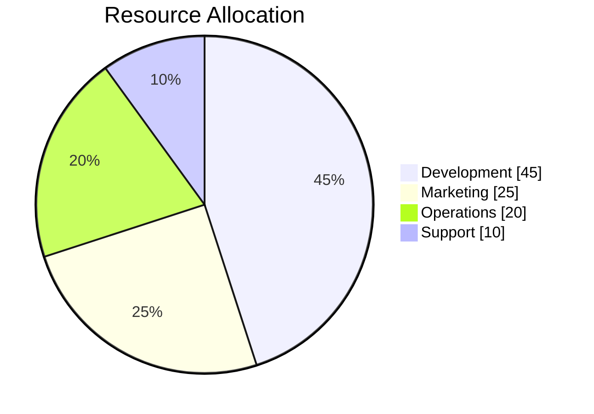

### ✅ Good - State Diagram (for lifecycles/status transitions):
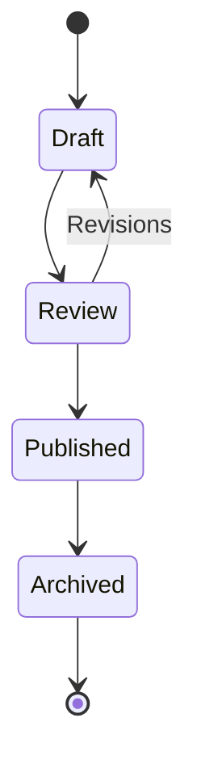

---

## Output Format (CRITICAL)

You MUST return your response in **patch format**. Study the article line numbers carefully, then return ONLY patch blocks.

**Example of CORRECT output** (inserting diagrams after line 18 and line 45):

[line 18]

Data Flow Overview:
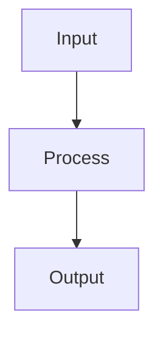

[line 45]

Authentication Steps:
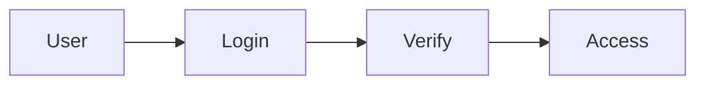

**IMPORTANT:**
- Each `[line NN]` marker MUST be on its own line
- Content after `[line NN]` is inserted AFTER that line number in the article
- Include a blank line after `[line NN]`, then the diagram title, then the mermaid block
- DO NOT return JSON, DO NOT wrap output in code fences
- Return ONLY the `[line NN]` blocks - nothing else

---

Article content:
{{content}}

{{file:shared/patch-mode-instructions.md}}
